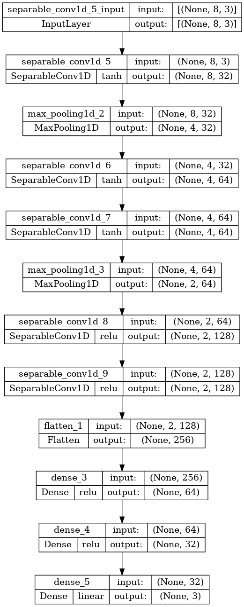

# magnetic-field-triangulation-via-deep-learning
This one is inspired by one of my projects at QuBiT lab UCLA, where we are designing and building a total-internal-reflection-fluorescence microscope to study [quantum aspects of the radical pair mechanism in proteins](https://github.com/tretyakovmipt/RPM-toy-simulation).  In order to estimate a magnetic field at a location where we can not place a sensor, I proposed to use an artificial neural network to predict (’triangulate’) the target field based on the readings from magnetic sensors around. Here, I test this idea with synthetic (numerically simulated) data.

# Experimental setup

A bio-sample is sandwiched between an electromagnet and a lightguide. The lightguide creates an evanescent field that excites the sample, leading to radical-pair creation and fluorescence. In a nutshell, we want to see how the fluorescence is affected by an external magnetic field. The separation between the magnet and the sample does not allow us to put the sensor directly onto the sample. I proposed to put several sensors around the sample to triangulate the target field. So far, I tried to see if the approach works with eight sensors. Figure shows only 4 sensors: S1-S4. 

.

# Motivation

The goal is to check that the magnet [calibration](https://github.com/tretyakovmipt/TIRF-magnet-calibration), which depends on how it is set up with respect to the sample, is correct.

Provided the sensors are attached to the TIRF platform, we’ll be able to tell the magnetic field at the sample, even if the magnet’s position or orientation with respect to the sample has changed or if there was a change in the ambient field. If it’s not what we expect, the magnet needs to be recalibrated.

# Neural network

So far, I ended up with a 3-channel 1D convolutional neural network with the following architecture:

.

The three channels correspond to the magnetic field’s x, y, and z components. For a given voltage, each channel receives an array with the corresponding magnetic field component from all eight sensors. The network outputs an array corresponding to the components of the target field.

# Results

The network overfits a bit, 

.

but its performance on the test set is not too bad.

.

Also, I checked that estimating the target field as an average of the sensor values does not work.

# Future steps

- Optimize the network hyperparameters to reduce overfitting.
- Expand the dataset, especially toward the smallest values.
- Test with a different sensor arrangement. I don’t think a cubic arrangement is possible in the actual experiment.
- Determine the minimal number of sensors needed.

# Content
## Simulation
* [generate_field.ipynb](https://github.com/tretyakovmipt/magnetic-field-triangulation-via-deep-learning/blob/main/simulation/generate_field.ipynb) magnetic field simulation that produces training, validation, and test data sets, and saves them to *data/*.
* [deep_learning.ipynb](https://github.com/tretyakovmipt/magnetic-field-triangulation-via-deep-learning/blob/main/simulation/deep_learning.ipynb) uses the simulated data sets for training and testing a network performing triangulation based on vector values.
* [deep_learning_1D.ipynb](https://github.com/tretyakovmipt/magnetic-field-triangulation-via-deep-learning/blob/main/simulation/deep_learning_1D.ipynb) uses the simulated data sets for training and testing a network performing triangulation based on scalar values.

