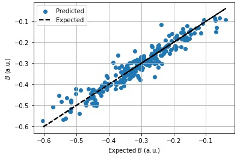

# magnetic-field-triangulation-via-deep-learning
This one is inspired by one of my projects at QuBiT lab UCLA, where we are designing and building a total-internal-reflection-fluorescence microscope to study [quantum aspects of the radical pair mechanism in proteins](https://github.com/tretyakovmipt/RPM-toy-simulation).  In order to estimate a magnetic field at a location where we can not place a sensor, I proposed to use an artificial neural network to predict (’triangulate’) the target field based on the readings from magnetic sensors around. Here, I test this idea with synthetic (numerically simulated) data.

# Experimental setup

A bio-sample is sandwiched between an electromagnet and a lightguide. The lightguide creates an evanescent field that excites the sample, leading to radical-pair creation and fluorescence. In a nutshell, we want to see how the fluorescence is affected by an external magnetic field. The separation between the magnet and the sample does not allow us to put the sensor directly onto the sample. I proposed to put several sensors around the sample to triangulate the target field. So far, I tried to see if the approach works with eight sensors. Figure shows only 4 sensors: S1-S4. 

.

# Motivation

The main goal is to be able to measure a magnetic field at a location where it is not possible to have a sensor during the experiment. In the setup described above, that would be the magnetic field inside the bio-sample. 

Provided the sensors are attached to the TIRF platform, we’ll be able to tell the magnetic field at the sample, even if the magnet’s position or orientation with respect to the sample has changed or if there was a change in the ambient field. 

Mangetic field triangulation can be useful in other types of experiments, e.g., in AMO physics, where one could tringulate the field inside of a vacuum chamber.

In addition, the triangulation principle can be generalized to other types of measurements other than magnetic fields, as long as there is clear dependence between values at several locations.

# Triangulation Principle

The triangulation is performed by a neutral network that takes measurements from the trinagulating sensors and outputs the field at the target location.

For the training and testing we need a dataset of measurements from the trinagulating sensors and a sensor at the target location.

Before working with real data, I performed a magnetic field simulation to test if the tringulation principle works and to choose the most approptiate neural networkk architecture.

# Results
## Simulation
More details can be found in the Jupyter notebooks in Simulation folder.

I ended up with a simple fully-connected network that makes a prediction based on scalar measurements.

The network overfits a bit, 

,

but its performance on the test set is not too bad.

.

Also, I checked that estimating the target field as an average of the sensor values does not work.

## Experiment
For the target field measurements I used a lake-shore Tesla meter. For the triangulating sensors I used sensors from Adafruit. We 3D printed a cube (shown below) nesting the trinagulating sensors and fitting the Tesla meter inside. 
.

Due to the specifics of the sensors and Tesla meter, we recorded only single component of the magnetic field vector on each of them.
Each sensor and Tesla meter provides an analog voltage proportional to the measure magnetic feild component, which was recorded with an NI DAQ. Witht the 3D electromagnet, we generated random magnetic field values, which were held constant during a short time step as is shown below.
.

The experimental sequences were control by a Python script run on LabScript control software. Since LabScript has a limit on how many datapoints it collect during a single run, we had to do several runs and combine them together. 

The network did not seem to work well with noisy data, so I created a cleaner dataset consisting of only the average values from each time step:

.
.

The network test is not perfect but kind of work in a proof-of-principle way:

.

# Content
## Simulation
* [generate_field.ipynb](https://github.com/tretyakovmipt/magnetic-field-triangulation-via-deep-learning/blob/main/simulation/generate_field.ipynb) magnetic field simulation that produces training, validation, and test data sets, and saves them to *data/*.
* [deep_learning.ipynb](https://github.com/tretyakovmipt/magnetic-field-triangulation-via-deep-learning/blob/main/simulation/deep_learning.ipynb) uses the simulated data sets for training and testing a network performing triangulation based on vector values.
* [deep_learning_1D.ipynb](https://github.com/tretyakovmipt/magnetic-field-triangulation-via-deep-learning/blob/main/simulation/deep_learning_1D.ipynb) uses the simulated data sets for training and testing a network performing triangulation based on scalar values.

## Experiment
* [magnetometer_data](https://github.com/tretyakovmipt/magnetic-field-triangulation-via-deep-learning/tree/main/experiment/experimental_data/magnitometer_data) has the data measurements recorded overal several experimental runs.
* [1D_triangulation.h5](https://github.com/tretyakovmipt/magnetic-field-triangulation-via-deep-learning/blob/main/experiment/1D_triangulation.h5) - saved trained neural network.
* [all_data.h5](https://github.com/tretyakovmipt/magnetic-field-triangulation-via-deep-learning/blob/main/experiment/all_data.h5) - all recorded measurements combined into a single dataset.
* [short_data.h5](https://github.com/tretyakovmipt/magnetic-field-triangulation-via-deep-learning/blob/main/experiment/short_data.h5) - data set with average magnetic field values corresponding to each time step.
* [data_analysis.ipynb](https://github.com/tretyakovmipt/magnetic-field-triangulation-via-deep-learning/blob/main/experiment/data_analysis.ipynb) - combines all the measurements into a single dataset (all_data.h5) and creates a cleaner data set with just average values (short_data.h5).
* [training.ipynb](https://github.com/tretyakovmipt/magnetic-field-triangulation-via-deep-learning/blob/main/experiment/training.ipynb) - training and testing the triangulation network on the real data.

# Future steps
- Test with a different sensor arrangement. I don’t think a cubic arrangement is possible in the actual experiment.
- Determine the minimal number of sensors needed.
- Find a way to record all three components of the target magnetic field at once.
- Expand the dataset, especially toward the smaller values.
- Optimize the network hyperparameters to reduce overfitting.

